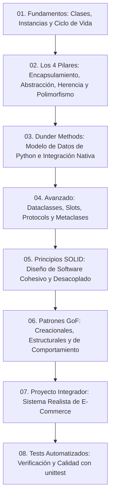

# 🐍 Master de Programación Orientada a Objetos (POO) en Python

Bienvenido al repositorio definitivo de **Programación Orientada a Objetos (POO) en Python**. Este proyecto ha sido concebido como una guía de referencia exhaustiva, didáctica y lista para producción, cubriendo desde los conceptos elementales hasta técnicas avanzadas de metaprogramación, arquitectura limpia con **SOLID** y patrones de diseño **GoF** en **Python 3.11+**.

---

## 📑 Tabla de Contenido
1. [Estructura del Proyecto](#-estructura-del-proyecto)
2. [Ruta de Aprendizaje Recomendada](#-ruta-de-aprendizaje-recomendada)
3. [Descripción de los Módulos](#-descripción-de-los-módulos)
   - [1. Fundamentos](#1-fundamentos-01_fundamentos)
   - [2. Los 4 Pilares de la POO](#2-los-4-pilares-de-la-poo-02_pilares)
   - [3. Métodos Mágicos (Dunder Methods)](#3-métodos-mágicos-dunder-methods-03_dunder_methods)
   - [4. Técnicas Avanzadas y Modernas](#4-técnicas-avanzadas-y-modernas-04_avanzado)
   - [5. Principios SOLID](#5-principios-solid-05_solid)
   - [6. Patrones de Diseño (GoF)](#6-patrones-de-diseño-06_patrones_diseno)
   - [7. Proyecto Integrador](#7-proyecto-integrador-07_proyecto_integrador)
   - [8. Pruebas Unitarias Automatizadas](#8-pruebas-unitarias-automatizadas-08_pruebas)
4. [Cómo Ejecutar el Proyecto](#-cómo-ejecutar-el-proyecto)

---

## 📂 Estructura del Proyecto

```text
poo-python/
│
├── README.md                           # Documentación central y guía pedagógica
├── run_all.py                          # Menú CLI interactivo y automatizador de ejecución
│
├── 01_fundamentos/                     # Bases fundamentales de POO
│   ├── 01_clases_y_objetos.py          # Clases, instancias, 'self', atributos de instancia
│   ├── 02_atributos_clase_instancia.py # Variables de clase vs instancia, mutabilidad y namespaces
│   ├── 03_metodos_instancia_clase_estaticos.py # self, @classmethod, @staticmethod
│   └── 04_ciclo_de_vida.py             # __new__, __init__, conteo de referencias y __del__
│
├── 02_pilares/                         # Los 4 Pilares Fundamentales
│   ├── 01_encapsulamiento.py           # Visibilidad, name mangling, decoradores @property y validación
│   ├── 02_abstraccion.py               # abc.ABC, @abstractmethod y contratos de interfaces
│   ├── 03_herencia.py                  # Herencia simple, múltiple, super(), MRO y Mixins
│   └── 04_polimorfismo.py              # Sobrescritura de métodos y Duck Typing
│
├── 03_dunder_methods/                  # Python Data Model (Métodos Doble Guion Bajo)
│   ├── 01_representacion.py            # __str__, __repr__, __format__ con especificadores
│   ├── 02_comparacion.py               # Rich comparisons, functools.total_ordering y contrato __hash__
│   ├── 03_operadores_aritmeticos.py    # Sobrecarga de +, -, *, reflejados (__radd__) e in-place (__iadd__)
│   ├── 04_contenedores_e_iteracion.py  # Emulación de secuencias (__len__, __getitem__, __contains__, __iter__)
│   └── 05_context_managers_y_call.py   # Objetos invocables (__call__) y gestores de contexto (__enter__, __exit__)
│
├── 04_avanzado/                        # Técnicas Modernas (Python 3.10+)
│   ├── 01_dataclasses.py               # @dataclass, frozen=True, field(default_factory) y __post_init__
│   ├── 02_slots.py                     # Optimización drástica de RAM con __slots__ y benchmark
│   ├── 03_composicion_vs_herencia.py   # Principio "Favor composition over inheritance"
│   ├── 04_typing_y_protocols.py        # Subtipado estructural y Duck typing estático con typing.Protocol
│   └── 05_metaclases.py                # type, creación dinámica de clases y metaclases personalizadas
│
├── 05_solid/                           # Arquitectura Limpia con Principios SOLID
│   ├── 01_single_responsibility.py     # S: Responsabilidad Única (Refactor de God Class)
│   ├── 02_open_closed.py               # O: Abierto para Extensión / Cerrado para Modificación
│   ├── 03_liskov_substitution.py       # L: Sustitución de Liskov (Jerarquías fieles al dominio)
│   ├── 04_interface_segregation.py     # I: Segregación de Interfaces (Evitar Fat Interfaces)
│   └── 05_dependency_inversion.py      # D: Inversión de Dependencias (Inyección de Dependencias)
│
├── 06_patrones_diseno/                 # Patrones de Diseño Gang of Four (GoF)
│   ├── 01_creacionales.py              # Singleton (metaclase), Factory Method y Builder fluido
│   ├── 02_estructurales.py             # Adapter (APIs incompatibles), Decorator OOP y Facade
│   └── 03_comportamiento.py            # Strategy, Observer (Pub/Sub) y Command con Undo
│
├── 07_proyecto_integrador/             # Sistema Comercial Completo de E-Commerce & Pasarela de Pagos
│   ├── __init__.py
│   ├── modelos.py                      # Clientes, Usuarios y Productos Físicos/Digitales
│   ├── carrito.py                      # Contenedor con Dunder Methods (+, len, in, iter)
│   ├── pasarelas.py                    # Abstracción de pasarelas (Stripe, PayPal)
│   ├── servicios.py                    # Checkout, Inyección de Dependencias, Estrategias y Observadores
│   └── main.py                         # Demostración del flujo completo de compra
│
└── 08_pruebas/                         # Pruebas Unitarias Automatizadas (unittest estándar)
    ├── __init__.py
    ├── test_fundamentos.py             # Verificación del bloque 01
    ├── test_pilares.py                 # Verificación del bloque 02
    ├── test_dunder.py                  # Verificación del bloque 03
    └── test_proyecto_integrador.py     # Verificación del proyecto integrador
```

---

## 🗺️ Ruta de Aprendizaje Recomendada



---

## 📘 Descripción de los Módulos

### 1. Fundamentos (`01_fundamentos/`)
- **`01_clases_y_objetos.py`**: Qué es una clase y un objeto, el rol de la convención `self`, inicialización con `__init__`, atributos y métodos de instancia.
- **`02_atributos_clase_instancia.py`**: Diferencias de ámbito (*scope*), inspección de namespaces vía `__dict__`, resolución de atributos y la trampa común de mutabilidad en atributos de clase.
- **`03_metodos_instancia_clase_estaticos.py`**: Métodos tradicionales vs `@classmethod` (usados como constructores alternativos) vs `@staticmethod` (utilidades puras).
- **`04_ciclo_de_vida.py`**: Fases de creación: `__new__` (reserva de memoria de bajo nivel), `__init__` (inicialización), conteo de referencias y `__del__` (garbage collection).

### 2. Los 4 Pilares de la POO (`02_pilares/`)
- **`01_encapsulamiento.py`**: Ocultamiento de información. Niveles de acceso (público, `_protegido`, `__privado`), Name Mangling y el uso idiomático del decorador `@property`, `@setter` y validaciones.
- **`02_abstraccion.py`**: Enfatizar lo esencial mediante el módulo estándar `abc`. Clases base abstractas (`ABC`), métodos abstractos (`@abstractmethod`) y properties abstractas.
- **`03_herencia.py`**: Herencia simple y múltiple, llamada cooperativa con `super()`, el Problema del Diamante, el algoritmo **MRO (C3 Linearization)** y arquitectura de **Mixins**.
- **`04_polimorfismo.py`**: Polimorfismo clásico por sobreescritura (*overriding*) y la filosofía central de Python: **Duck Typing** ("Si camina como pato y grazna como pato...").

### 3. Métodos Mágicos / Dunder Methods (`03_dunder_methods/`)
- **`01_representacion.py`**: Diferencia técnica entre `__str__` (para el usuario) y `__repr__` (para el desarrollador/logs). Especificadores con `__format__`.
- **`02_comparacion.py`**: Métodos relacionales (`__eq__`, `__lt__`, `__gt__`), optimización con `@functools.total_ordering` y contrato de hashabilidad (`__hash__`).
- **`03_operadores_aritmeticos.py`**: Sobrecarga de operadores matemáticos (`+`, `-`, `*`), operadores reflejados (`__rmul__`) e in-place (`__iadd__`). Demostrado con una clase `Vector2D`.
- **`04_contenedores_e_iteracion.py`**: Emulación de secuencias de Python (`len()`, indexación `[]`, slicing `[1:3]`, operador de pertenencia `in`, iteración `for`).
- **`05_context_managers_y_call.py`**: Objetos invocables como funciones (`__call__`) y administración segura de recursos mediante gestores de contexto (`with`, `__enter__`, `__exit__`).

### 4. Técnicas Avanzadas y Modernas (`04_avanzado/`)
- **`01_dataclasses.py`**: Clases orientadas a datos con `@dataclass`, inmutabilidad (`frozen=True`), manejo de listas por defecto (`default_factory`) y validaciones con `__post_init__`.
- **`02_slots.py`**: Optimización drástica de memoria RAM y velocidad prescindiendo de `__dict__` mediante `__slots__`. Incluye benchmark con `tracemalloc`.
- **`03_composicion_vs_herencia.py`**: El principio *Favor composition over inheritance*. Comparativa práctica entre relaciones "Es-Un" vs "Tiene-Un".
- **`04_typing_y_protocols.py`**: Subtipado estructural con `typing.Protocol` (Duck Typing Estático verificado por IDEs y analizadores estáticos).
- **`05_metaclases.py`**: Clases como instancias de metaclases (`type`). Creación dinámica de clases y metaclases para registro automático de plugins en tiempo de importación.

### 5. Principios SOLID (`05_solid/`)
- **`01_single_responsibility.py` (SRP)**: Una clase, una sola razón para cambiar. Refactorización de una "God Class" monolítica a servicios modulares.
- **`02_open_closed.py` (OCP)**: Abierto a extensión, cerrado a modificación. Eliminar `if/elif` extensibles con estrategias polimórficas.
- **`03_liskov_substitution.py` (LSP)**: Subclases que pueden sustituir a sus clases base sin romper el comportamiento esperado del sistema.
- **`04_interface_segregation.py` (ISP)**: Interfaces pequeñas y enfocadas en lugar de interfaces sobrecargadas que obligan a implementar métodos inútiles.
- **`05_dependency_inversion.py` (DIP)**: Los módulos de alto nivel dependen de abstracciones mediante Inyección de Dependencias.

### 6. Patrones de Diseño GoF (`06_patrones_diseno/`)
- **`01_creacionales.py`**:
  - **Singleton**: Una sola instancia en memoria implementado con metaclase.
  - **Factory Method**: Creación desacoplada de notificadores.
  - **Builder**: Construcción fluida y paso a paso de objetos complejos (`ComputadoraBuilder`).
- **`02_estructurales.py`**:
  - **Adapter**: Conectar una API XML legacy a una interfaz moderna.
  - **Decorator (OOP)**: Agregar características de forma acumulativa en capas (Café con leche, caramelo).
  - **Facade**: Interfaz unificada de alto nivel para subsistemas complejos de cine en casa.
- **`03_comportamiento.py`**:
  - **Strategy**: Algoritmos de cálculo de rutas intercambiables en caliente.
  - **Observer (Pub/Sub)**: Sistema reactivo de notificación de eventos a múltiples suscriptores.
  - **Command**: Encapsulación de acciones con soporte completo para deshacer operaciones (Undo / Ctrl+Z).

### 7. Proyecto Integrador (`07_proyecto_integrador/`)
Un caso de estudio real de una **Plataforma de E-Commerce y Pagos Multicanal** que amalgama todos los conceptos anteriores:
- Modelado con `@dataclass`, encapsulación y validaciones (`modelos.py`).
- Carrito de compras con métodos mágicos: `len(carrito)`, `carrito + producto`, `for item in carrito:` (`carrito.py`).
- Pasarelas de pago abstractas (`Stripe`, `PayPal`) aplicando polimorfismo (`pasarelas.py`).
- Servicio de Checkout con Inyección de Dependencias, estrategias de descuento y bus de observadores para facturación y correos (`servicios.py`).

### 8. Pruebas Unitarias Automatizadas (`08_pruebas/`)
Suite integral con **17 pruebas automatizadas** utilizando el módulo estándar `unittest` de Python, garantizando que cada concepto, validación y regla de negocio funcione con 100% de confiabilidad sin requerir dependencias externas.

---

## 🚀 Cómo Ejecutar el Proyecto

### Requisitos
- **Python 3.11** o superior instalado en el sistema.
- Cero dependencias externas necesarias (utiliza únicamente la librería estándar de Python).

### 1. Lanzador Interactivo (Recomendado)
Ejecuta el menú visual interactivo en la terminal:
```bash
python run_all.py
```
Desde el menú podrás elegir qué lección individual ejecutar, correr todas las lecciones en secuencia (`T`), o ejecutar la suite de pruebas (`P`).

### 2. Ejecutar la Suite de Pruebas Unitarias
```bash
python -m unittest discover -s 08_pruebas -p "test_*.py" -v
```
o directamente con el CLI:
```bash
python run_all.py test
```

### 3. Ejecutar Cualquier Módulo Individualmente
Cada archivo es 100% independiente y ejecutable:
```bash
# Fundamentos
python 01_fundamentos/01_clases_y_objetos.py

# Pilares
python 02_pilares/01_encapsulamiento.py

# Dunder Methods
python 03_dunder_methods/03_operadores_aritmeticos.py

# Avanzado
python 04_avanzado/01_dataclasses.py

# SOLID
python 05_solid/05_dependency_inversion.py

# Patrones GoF
python 06_patrones_diseno/01_creacionales.py

# Proyecto Integrador
python 07_proyecto_integrador/main.py
```
